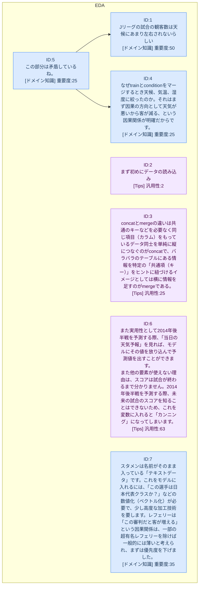

# 思考フロー

> 生成日時: 2026-05-05 02:03
> 総記録数: 7件 | ★ = 80点以上

## フェーズ別思考密度

| フェーズ | 件数 | 平均スコア | ★ハイライト | 最多の型 |
|---|---|---|---|---|
| EDA | 7 | 32.1 | 0 | ドメイン知識 |

## カテゴリ凡例

| カテゴリ | スコアラベル |
|---|---|
| ドメイン知識 | 重要度 |
| 仮説 | ひらめき度 |
| 検証 | 工夫度 |
| 結果 | 発見度 |
| Tips | 汎用性 |
| ★ハイライト (80点以上) | — |
